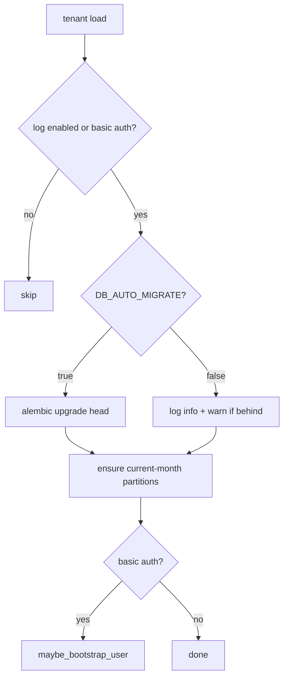

# Database migrations (`gwapi` schema)

The API owns a single Postgres schema, `gwapi`, in each tenant database. It holds
the basic-auth tables (`users`, `roles`, `user_roles`) and the audit log tables
(`gw_api_logs`, `gw_api_logs_db`). Its layout is managed by [Alembic](https://alembic.sqlalchemy.org/)
with plain SQL migrations — there are no ORM models, and the application keeps
using psycopg for all runtime queries.

The Giswater business schema (`DB_SCHEMA`, e.g. `ws_40`) is **not** owned by the
API and is installed/upgraded separately.

## What is managed where

| Concern | Owner |
| --- | --- |
| Tables, indexes, columns, role seed | Alembic revisions in [`alembic/versions/`](../alembic/versions/) |
| Migration bookkeeping | `gwapi.alembic_version` |
| Monthly log partitions | Runtime (`app/db/partitions.py`), created on demand |
| First basic-auth user | Runtime (`maybe_bootstrap_user`), driven by `AUTH_BASIC_BOOTSTRAP_*` |
| Schema resolution / legacy fallback | `app/db/schema.py` (`resolve_log_schema`) |
| Migration runner + orchestration | `app/db/migrate.py` (`ensure_tenant_database`) |

## When migrations run

On tenant load (startup, reload, create/update), `ensure_tenant_database` runs if
logging is enabled or the tenant uses basic auth. With `DB_AUTO_MIGRATE=true`
(the default) it runs `alembic upgrade head`, then ensures the current-month log
partitions and bootstraps the first user.

Migration failures are **non-fatal**: the tenant still loads, and the legacy
schema resolver keeps the API serving against the old `log` schema until the
issue is fixed.



## Fresh install vs upgrade from the `log` schema

The two shipped revisions are idempotent and cover both cases:

- `0001_gwapi_initial` — creates the `gwapi` schema and the auth tables (these
  already lived in `gwapi` on 1.4.0, so this is a no-op on existing deployments).
- `0002_log_tables` — relocates `log.gw_api_logs*` into `gwapi` (moving partitions
  and preserving all rows) when present, otherwise creates the log tables fresh in
  `gwapi`, then drops the now-empty `log` schema.

### Legacy `log` schema compatibility (DEPRECATED #26)

Until a tenant has been migrated, `resolve_log_schema()` detects where the audit
tables live and routes reads/writes accordingly:

1. `gwapi.gw_api_logs` exists -> use `gwapi`.
2. else `log.gw_api_logs` exists -> use `log` (logs a `DEPRECATED #26` warning).
3. else -> target `gwapi` (fresh database; Alembic will create the tables).

The result is cached per tenant and invalidated after a successful upgrade, so
the switch to `gwapi` is automatic. The `log` schema fallback is removed in
**2.0.0** (grep `DEPRECATED #26`).

## CLI

```bash
giswater-api db upgrade --all          # upgrade every loaded tenant
giswater-api db upgrade --tenant acme  # upgrade a single tenant
giswater-api db current --tenant acme  # show the applied revision
giswater-api db history                # list known revisions (no DB access)
```

Use `--tenants-dir` to point at a tenants directory when not running inside the
FastAPI lifespan.

## Upgrade paths for existing deployments

### Path A — default, zero-touch

1. Deploy the new image without `.env` changes (`DB_AUTO_MIGRATE` defaults to `true`).
2. Restart. Each tenant migrates on load; the resolver switches to `gwapi`.
3. Optionally verify with `giswater-api db current --tenant <id>`.

### Path B — controlled window

1. Set `DB_AUTO_MIGRATE=false` in the root `.env` and deploy.
2. The API keeps working: logs stay in `log`, auth stays in `gwapi`.
3. During maintenance, run `giswater-api db upgrade --all`.
4. The resolver switches to `gwapi` automatically; no second deploy needed.

## Rollback

- Roll back the image to the previous version.
- If a schema move already completed, the old image only knows the `log` schema,
  so rolling back the image alone is **not** enough. First run
  `alembic downgrade -1` (moves the tables back to `log`) or restore from backup.

## Adding a new revision

Migrations are raw SQL. Create a revision and edit it by hand (no autogenerate):

```bash
alembic revision -m "describe change"
```

In the generated file, use `op.execute("...")` with idempotent DDL where
practical (`CREATE ... IF NOT EXISTS`, guarded `DO $$ ... $$` blocks). Keep the
table-name constants in [`app/db/schema.py`](../app/db/schema.py) in sync.

## Required database privileges

The tenant DB user needs `CREATE` on the database (to create the `gwapi` schema
and tables) and, for the one-time relocation, the privileges to run
`ALTER TABLE ... SET SCHEMA` on the legacy `log` tables. These match what the
previous runtime DDL bootstrap already required.
